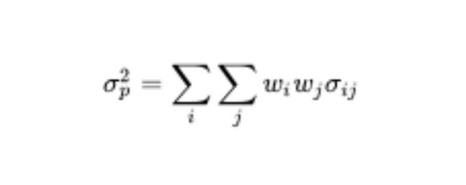
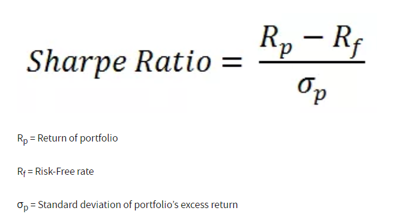
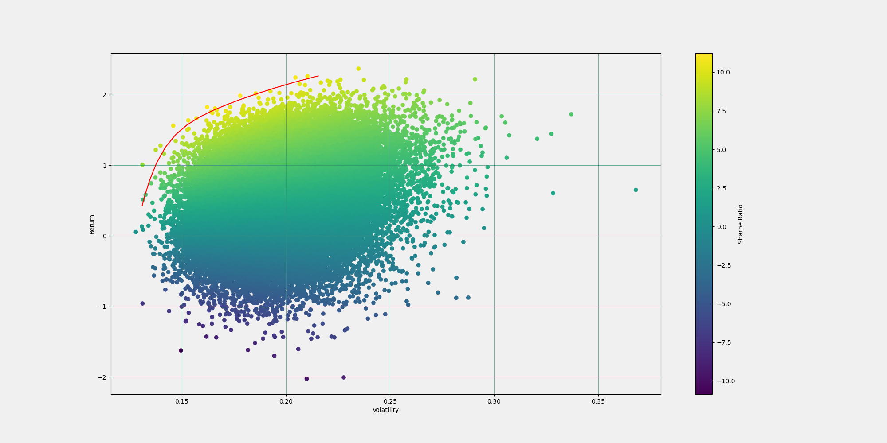

# MPT, The Efficient Frontier, and LSTM's
## An open source project by Jacob Somer
### Goals of this project
1. Get historical stock market data programatically through an API
2. Forecast daily stock prices and covariance using Long Short Term Memory Networks
3. Visualize the [Efficient Frontier](https://en.wikipedia.org/wiki/Efficient_frontier) and discover new insights in the art of Stock market prediction

*note: if you only want to see step 3, please scroll down to the bottom*

### Helpful resources
For those who are just starting their learning journey in computational finance, here are some learning resources:

* [Youtube Video on Portfolio Management by MIT](https://www.youtube.com/watch?v=8TJQhQ2GZ0Y) 
* [Youtube Series on Machine Learning by 3Blue1Brown](https://www.youtube.com/playlist?list=PLZHQObOWTQDNU6R1_67000Dx_ZCJB-3pi) 
* [Time Series Forecasting with Keras](https://keras.io/examples/timeseries/timeseries_weather_forecasting/) 
* [Modern Portfolio Theory Wiki](https://en.wikipedia.org/wiki/Modern_portfolio_theory) 


## The Dataset

This project uses AlphaVantage's [API](https://www.alphavantage.co/documentation/) to get historical data. The benefits of using Alpha Vantage is that their API is free to use. The downside is that they only allow 5 API calls per minute. To account for this, I parralelized the getData() function using the multiparallel library (lines 182-186 in Forecast.py):
```
num_cores = multiprocessing.cpu_count()
tmp = tqdm(stockList[i*5:i*5+5])

#parrallizing getting data because its faster
stockData = Parallel(n_jobs=num_cores)(delayed(getData)(j) for j in tmp)
``` 
Get data returns a list of historical data for any stock symbol you give it. In our case, get data returns the open and close price which we will later use as inputs for our returns and covariance prediction. Here is an example dataset plotted with Matplotlib:


A first order observation of this time series (which applies to most assets on the NYSE) is that there is an exponential growth pattern to the price. I accounted this by log transforming the data before feeding it to the LSTM (line 193 in Forecast.py):
```
2**predictNextDay(list(map(lambda x: np.log2(x), np.array(j[0])))
```

`np.array(j[0])` is a numpy array of historical prices. predictNextDay() is a function that trains our neural net and outputs a prediction for the next day. Inside the function, we use the sklearn MinMaxScaler() to scale our data from 0 to 1 which is necessary as our LSTM's reccurent activation layer uses a sigmoid function (lines 55-57 in Forecast.py):
```
scaler = MinMaxScaler()
scaler = scaler.fit((np.array(data)).reshape(-1, 1))
data_scaled = scaler.transform((np.array(data)).reshape(-1, 1))
```

## The Long Short-Term Memory Network

The reason for using an [LSTM](https://colah.github.io/posts/2015-08-Understanding-LSTMs/) is because it has a fairly good track record when it comes to time-series forecasting. Unlike a traditional [Reccurent Neural Network](https://colah.github.io/posts/2015-08-Understanding-LSTMs/), the lstm maintains both a cell state and a hidden state to pass contextual information. Basically, an [LSTM](https://colah.github.io/posts/2015-08-Understanding-LSTMs/) is an [RNN](https://colah.github.io/posts/2015-08-Understanding-LSTMs/) with gates. Here is an image to demonstrate the input, forget, output, and tanh layers respectively. Each of the first four functions represent a neural network. The last two functions represent the output cell state and hidden state to be passed on to the next [LSTM](https://colah.github.io/posts/2015-08-Understanding-LSTMs/) layer. 


Luckily for us, Keras provides an easy to use API that does all of these operations given properly formatted data. We can even customize our activation functions with something like [RELU](https://www.google.com/search?q=relu&oq=relu&aqs=chrome.0.69i59j0i433i457j0i433l5j0.727j0j7&sourceid=chrome&ie=UTF-8) or [Sotftmax](https://en.wikipedia.org/wiki/Softmax_function), but for this project, I used [GPU compute](https://developer.nvidia.com/CUDNN) which requires our LSTM to have the feutures below: 
```
activation == tanh
recurrent_activation == sigmoid
recurrent_dropout == 0
unroll is False
use_bias is True
Inputs, if use masking, are strictly right-padded.
Eager execution is enabled in the outermost context.
```
In order to achieve better results given these requirements, I had to spend more time preprocessing (Log and MinMax scaling). This was important as it cut down overall execution time nearly 6 fold. It also used an average of 24% of my CPU rather than the 100% it was using without [GPU](https://developer.nvidia.com/CUDNN). Below I've posted the code for the entire predictNextDay() function to see the whole prediction in action:
```
def predictNextDay(data, activationFunction="tanh",lossFunction='mse',numberOfEpochs=10):
    scaler = MinMaxScaler()
    scaler = scaler.fit((np.array(data)).reshape(-1, 1))
    data_scaled = scaler.transform((np.array(data)).reshape(-1, 1))
    
    #--------- the separated code was modified from https://machinelearningmastery.com/how-to-develop-lstm-models-for-time-series-forecasting/ ------
    def split_sequence(sequence, n_steps):
        X, y = list(), list()
        for i in range(len(sequence)):
            end_ix = i + n_steps
            if end_ix > len(sequence)-1:
                break
            seq_x, seq_y = sequence[i:end_ix], sequence[end_ix]
            X.append(seq_x)
            y.append(seq_y)
        return np.array(X), np.array(y)
    raw_seq = data_scaled
    n_steps = 50
    X, y = split_sequence(raw_seq, n_steps)
    n_features = 1
    X = X.reshape((X.shape[0], X.shape[1], n_features))
    #------------------------------------------------------------------------------------------------------------------------------------------
    
    model = Sequential()
    model.add(LSTM(128, activation= activationFunction, input_shape=(n_steps, n_features),return_sequences=False))    
    model.add(Dense(1))
    opt = keras.optimizers.Adam(learning_rate=0.001)
    model.compile(optimizer=opt, loss=lossFunction)
    
    history = model.fit(X, y, epochs=numberOfEpochs,batch_size=256,validation_split=0.1, verbose=1)
    
    x_input = data_scaled[-50:]
    x_input = x_input.reshape((1, n_steps, n_features))
    forecast = model.predict(x_input, verbose=0)
    forecast_copies = np.repeat(forecast[0][0], len(data), axis=-1).reshape(-1,1)
    y_pred_future = scaler.inverse_transform(forecast_copies)
    return y_pred_future[0][0]

``` 
## Putting It All Together

Now that we have our [Data](https://www.alphavantage.co/documentation/) and [LSTM](https://colah.github.io/posts/2015-08-Understanding-LSTMs/), we can finally make our predicion. The rest of the code does exactly this. We predict 1 day returns for a list of stocks which is then saved as a CSV. Below is an example run:

```
|FIELD1|Original Price|Predicted Price|Predicted Returns|
|------|--------------|---------------|-----------------|
|AMZN  |3256.93       |3339.087866    |0.025225555      |
|BA    |214.06        |220.4016687    |0.02962566       |
|GOOGL |1752.64       |1764.694801    |0.006878082      |
|TSLA  |705.67        |680.5043021    |-0.035662134     |
|ALB   |147.52        |146.0896406    |-0.009696037     |
|HSY   |152.33        |149.7741663    |-0.016778269     |
|AAPL  |132.69        |136.5794348    |0.029312192      |
|AAL   |15.77         |16.2704293     |0.031732993      |
|PTON  |151.72        |159.5287602    |0.051468232      |
|GS    |263.71        |256.3056341    |-0.028077683     |
|PFE   |36.81         |36.89022841    |0.002179528      |
|BABA  |232.73        |240.5977046    |0.033806147      |
|BILI  |85.72         |87.25834944    |0.017946214      |
|PDD   |177.67        |154.3807462    |-0.131081521     |
|GME   |18.84         |20.45343732    |0.085638924      |
|CRWD  |211.82        |218.4764087    |0.031424836      |
|NIO   |48.74         |50.65778519    |0.039347255      |
|NVAX  |111.51        |121.7997714    |0.092276669      |
|MRNA  |104.47        |116.8146009    |0.118164075      |
|RIOT  |16.99         |17.13257957    |0.00839197       |
|MARA  |10.44         |11.893067      |0.139182663      |
|GPRO  |8.28          |8.49123953     |0.02551202       |
|ZM    |337.32        |375.7675387    |0.113979422      |
|NFLX  |540.73        |533.0092563    |-0.014278371     |
|AMD   |91.71         |91.53953699    |-0.001858718     |
|NCLH  |25.43         |25.71956658    |0.01138681       |
|LULU  |348.03        |352.055856     |0.011567555      |
|ROKU  |332.02        |327.0451186    |-0.01498368      |
|FB    |273.16        |270.9626493    |-0.008044189     |
|PLTR  |23.55         |28.41581799    |0.206616475      |
|TGT   |176.53        |173.1225533    |-0.019302366     |
|WMT   |144.15        |143.6615931    |-0.003388185     |
|SPWR  |25.64         |25.79706579    |0.006125811      |
|APPN  |162.09        |158.2509475    |-0.023684696     |
|PINS  |65.9          |78.91454847    |0.197489355      |
|FSLR  |98.92         |99.10851441    |0.001905726      |
|FSLY  |87.37         |95.5518423     |0.0936459        |
|INO   |8.85          |8.787814912    |-0.007026564     |
|FCEL  |11.17         |11.20682694    |0.003296951      |
|FUBO  |28            |39.99297845    |0.428320659      |
```

I then predicted covariance for each asset that had positive returns. 


```
|FIELD1|AMZN        |BA          |GOOGL       |AAPL        |AAL         |PTON        |PFE         |BABA       |BILI       |GME         |CRWD       |NIO         |NVAX        |MRNA        |RIOT        |MARA        |GPRO        |ZM          |NCLH        |LULU       |PLTR        |SPWR        |PINS       |FSLR        |FSLY        |FCEL        |FUBO        |
|------|------------|------------|------------|------------|------------|------------|------------|-----------|-----------|------------|-----------|------------|------------|------------|------------|------------|------------|------------|------------|-----------|------------|------------|-----------|------------|------------|------------|------------|
|AMZN  |1           |0.10987716  |0.32984352  |0.55707353  |0.085765176 |-0.34008452 |0.039308727 |0.44199246 |0.24296074 |0.09573891  |-0.20651348|-0.12820147 |-0.0684354  |-0.2135387  |0.20433041  |0.23225136  |0.092826456 |0.004463636 |0.08885835  |0.31347218 |0.07415598  |-0.000834754|0.005786201|0.062976144 |-0.01691416 |-0.18378855 |0.158472    |
|BA    |0.10987716  |1           |0.21435305  |0.2263215   |0.5425453   |-0.059875347|0.272935    |0.2809141  |0.29920518 |0.19424333  |0.002237223|0.08036058  |0.15343848  |-0.023020651|0.021079203 |0.15974237  |0.2887323   |0.087713405 |0.26720402  |0.24861883 |1.0108032   |0.2417749   |0.19282103 |0.24410895  |0.28716648  |0.17939833  |0.2594718   |
|GOOGL |0.32984352  |0.21435305  |1           |0.4732428   |0.3451439   |-0.36720774 |0.21040933  |0.22291622 |-0.11163318|0.06192819  |-0.2937872 |-0.32914144 |0.037094656 |-0.22033003 |-0.091516055|0.07536145  |0.094128005 |-0.4071684  |0.41701314  |0.027033541|-0.13386962 |-0.12839365 |-0.11076725|-0.07620644 |-0.2865174  |-0.13916638 |-0.11976863 |
|AAPL  |0.55707353  |0.2263215   |0.4732428   |1           |0.24348125  |0.022801923 |-0.069766745|0.18131618 |0.10031374 |0.28710654  |-0.1613986 |-0.21193704 |-0.13548318 |-0.3845958  |0.14679089  |0.3240663   |0.23801734  |-0.1783387  |0.3297365   |0.21350373 |0.044837456 |0.16279125  |0.033425227|0.27820122  |0.112657845 |-0.07706987 |0.11726539  |
|AAL   |0.085765176 |0.5425453   |0.3451439   |0.24348125  |1           |-0.13004139 |0.13625045  |0.21085125 |0.07101188 |0.19368492  |-0.35443932|-0.057940327|0.07168106  |-0.049951326|0.08522637  |-0.033552323|0.20323744  |-0.30025083 |0.6156332   |0.07309814 |0.1499729   |0.056490645 |-0.10119214|0.11274786  |-0.044680003|0.08606633  |-0.046137955|
|PTON  |-0.34008452 |-0.059875347|-0.36720774 |0.022801923 |-0.13004139 |1           |-0.012537658|0.018640395|0.2889725  |0.29807097  |0.57241064 |0.41510388  |0.31115362  |0.15252577  |0.13283923  |0.4058267   |-0.009612067|0.52856743  |-0.0684379  |0.13851234 |0.17683828  |0.5564396   |0.2377919  |0.42347634  |0.36052182  |0.58425653  |0.027473297 |
|PFE   |0.039308727 |0.272935    |0.21040933  |-0.069766745|0.13625045  |-0.012537658|1           |0.17724268 |-0.0775779 |0.07998945  |-0.15847836|-0.10744846 |0.47165745  |0.4539881   |-0.2630013  |-0.051903285|-0.06605355 |-0.14584169 |0.026990945 |0.34744126 |1.0145609   |-0.17406377 |0.2883626  |-0.1972577  |-0.010772206|0.036997013 |0.07873135  |
|BABA  |0.44199246  |0.2809141   |0.22291622  |0.18131618  |0.21085125  |0.018640395 |0.17724268  |1          |0.4449645  |-0.0793984  |-0.18644455|0.093330175 |0.20226444  |0.14265306  |0.12494215  |0.018541312 |-0.08917704 |0.15632677  |0.24146318  |0.30264938 |0.250878    |-0.12224447 |0.011221982|-0.08495231 |0.008293495 |0.023364803 |0.21692227  |
|BILI  |0.24296074  |0.29920518  |-0.11163318 |0.10031374  |0.07101188  |0.2889725   |-0.0775779  |0.4449645  |1          |-0.1000166  |0.14144135 |0.3448775   |0.24698117  |0.008330593 |0.23869254  |0.2108957   |0.102081805 |0.15314454  |0.13676909  |0.360927   |0.8767812   |0.2756304   |-0.12326559|0.32016173  |0.21805795  |0.29602295  |0.25948897  |
|GME   |0.09573891  |0.19424333  |0.06192819  |0.28710654  |0.19368492  |0.29807097  |0.07998945  |-0.0793984 |-0.1000166 |1           |0.27404693 |-0.18908122 |0.08237568  |-0.112513445|0.04027922  |0.21500106  |0.28923142  |-0.14990565 |0.17163315  |0.1842721  |0.061283838 |0.2512877   |0.193186   |0.29531056  |0.16390474  |0.3368579   |0.27513784  |
|CRWD  |-0.20651348 |0.002237223 |-0.2937872  |-0.1613986  |-0.35443932 |0.57241064  |-0.15847836 |-0.18644455|0.14144135 |0.27404693  |1          |0.15388617  |-0.21691146 |-0.21596268 |0.078706145 |0.16866498  |0.114952445 |0.15779601  |-0.24497777 |0.022795828|0.7755477   |0.4226596   |0.18785869 |0.4690698   |0.39876515  |0.39465275  |0.23939371  |
|NIO   |-0.12820147 |0.08036058  |-0.32914144 |-0.21193704 |-0.057940327|0.41510388  |-0.10744846 |0.093330175|0.3448775  |-0.18908122 |0.15388617 |1           |-0.013724548|0.06615817  |0.021217596 |0.016090691 |-0.10266666 |0.16488901  |-0.1751091  |0.1669818  |0.5301606   |0.13453603  |-0.05017103|0.13511524  |0.114857264 |0.15030077  |0.07400232  |
|NVAX  |-0.0684354  |0.15343848  |0.037094656 |-0.13548318 |0.07168106  |0.31115362  |0.47165745  |0.20226444 |0.24698117 |0.08237568  |-0.21691146|-0.013724548|1           |0.51959515  |-0.1539205  |0.018768912 |-0.14890562 |-0.030445185|0.018843474 |0.29626837 |0.5997709   |-0.09287103 |0.0479173  |-0.075475164|-0.03853553 |0.112356305 |0.013048089 |
|MRNA  |-0.2135387  |-0.023020651|-0.22033003 |-0.3845958  |-0.049951326|0.15252577  |0.4539881   |0.14265306 |0.008330593|-0.112513445|-0.21596268|0.06615817  |0.51959515  |1           |-0.3697437  |-0.25208828 |-0.21575706 |0.024772247 |-0.16956824 |0.1812039  |0.4022458   |-0.35591915 |0.07590554 |-0.39622304 |-0.069182664|-0.057662517|-0.11820875 |
|RIOT  |0.20433041  |0.021079203 |-0.091516055|0.14679089  |0.08522637  |0.13283923  |-0.2630013  |0.12494215 |0.23869254 |0.04027922  |0.078706145|0.021217596 |-0.1539205  |-0.3697437  |1           |0.28218994  |0.16009286  |-0.019084448|0.046705704 |-0.10688605|-0.19108155 |0.23525947  |0.05866062 |0.25203282  |-0.043244325|0.14662409  |-0.05895136 |
|MARA  |0.23225136  |0.15974237  |0.07536145  |0.3240663   |-0.033552323|0.4058267   |-0.051903285|0.018541312|0.2108957  |0.21500106  |0.16866498 |0.016090691 |0.018768912 |-0.25208828 |0.28218994  |1           |0.23660102  |0.124132104 |-0.07795801 |0.30489856 |0.4983893   |0.2606735   |0.16807373 |0.32399732  |0.20035076  |0.112856306 |0.3663759   |
|GPRO  |0.092826456 |0.2887323   |0.094128005 |0.23801734  |0.20323744  |-0.009612067|-0.06605355 |-0.08917704|0.102081805|0.28923142  |0.114952445|-0.10266666 |-0.14890562 |-0.21575706 |0.16009286  |0.23660102  |1           |-0.097774796|0.01918717  |0.056276113|0.07740984  |0.32858634  |0.13059247 |0.32406142  |0.2075565   |0.16773608  |0.2854224   |
|ZM    |0.004463636 |0.087713405 |-0.4071684  |-0.1783387  |-0.30025083 |0.52856743  |-0.14584169 |0.15632677 |0.15314454 |-0.14990565 |0.15779601 |0.16488901  |-0.030445185|0.024772247 |-0.019084448|0.124132104 |-0.097774796|1           |-0.36791152 |0.3133664  |0.012655743 |0.06675496  |0.23238698 |-0.018405672|0.078409605 |0.041480355 |-0.04859155 |
|NCLH  |0.08885835  |0.26720402  |0.41701314  |0.3297365   |0.6156332   |-0.0684379  |0.026990945 |0.24146318 |0.13676909 |0.17163315  |-0.24497777|-0.1751091  |0.018843474 |-0.16956824 |0.046705704 |-0.07795801 |0.01918717  |-0.36791152 |1           |0.048581414|-0.056536112|0.04853786  |-0.20627399|0.09392895  |-0.16176154 |0.111475356 |-0.06446629 |
|LULU  |0.31347218  |0.24861883  |0.027033541 |0.21350373  |0.07309814  |0.13851234  |0.34744126  |0.30264938 |0.360927   |0.1842721   |0.022795828|0.1669818   |0.29626837  |0.1812039   |-0.10688605 |0.30489856  |0.056276113 |0.3133664   |0.048581414 |1          |0.24511535  |0.045239817 |0.18083934 |0.07894838  |0.29684532  |-0.01815308 |0.31739587  |
|PLTR  |0.07415598  |1.0108032   |-0.13386962 |0.044837456 |0.1499729   |0.17683828  |1.0145609   |0.250878   |0.8767812  |0.061283838 |0.7755477  |0.5301606   |0.5997709   |0.4022458   |-0.19108155 |0.4983893   |0.07740984  |0.012655743 |-0.056536112|0.24511535 |1           |0.25787917  |0.43889797 |0.21482228  |0.75299644  |0.49058294  |0.6754939   |
|SPWR  |-0.000834754|0.2417749   |-0.12839365 |0.16279125  |0.056490645 |0.5564396   |-0.17406377 |-0.12224447|0.2756304  |0.2512877   |0.4226596  |0.13453603  |-0.09287103 |-0.35591915 |0.23525947  |0.2606735   |0.32858634  |0.06675496  |0.04853786  |0.045239817|0.25787917  |1           |0.142645   |0.80871505  |0.114654325 |0.42148635  |0.282633    |
|PINS  |0.005786201 |0.19282103  |-0.11076725 |0.033425227 |-0.10119214 |0.2377919   |0.2883626   |0.011221982|-0.12326559|0.193186    |0.18785869 |-0.05017103 |0.0479173   |0.07590554  |0.05866062  |0.16807373  |0.13059247  |0.23238698  |-0.20627399 |0.18083934 |0.43889797  |0.142645    |1          |0.11062791  |0.36521164  |0.11056294  |0.1321116   |
|FSLR  |0.062976144 |0.24410895  |-0.07620644 |0.27820122  |0.11274786  |0.42347634  |-0.1972577  |-0.08495231|0.32016173 |0.29531056  |0.4690698  |0.13511524  |-0.075475164|-0.39622304 |0.25203282  |0.32399732  |0.32406142  |-0.018405672|0.09392895  |0.07894838 |0.21482228  |0.80871505  |0.11062791 |1           |0.2341638   |0.43822697  |0.23503174  |
|FSLY  |-0.01691416 |0.28716648  |-0.2865174  |0.112657845 |-0.044680003|0.36052182  |-0.010772206|0.008293495|0.21805795 |0.16390474  |0.39876515 |0.114857264 |-0.03853553 |-0.069182664|-0.043244325|0.20035076  |0.2075565   |0.078409605 |-0.16176154 |0.29684532 |0.75299644  |0.114654325 |0.36521164 |0.2341638   |1           |0.15752539  |0.17920262  |
|FCEL  |-0.18378855 |0.17939833  |-0.13916638 |-0.07706987 |0.08606633  |0.58425653  |0.036997013 |0.023364803|0.29602295 |0.3368579   |0.39465275 |0.15030077  |0.112356305 |-0.057662517|0.14662409  |0.112856306 |0.16773608  |0.041480355 |0.111475356 |-0.01815308|0.49058294  |0.42148635  |0.11056294 |0.43822697  |0.15752539  |1           |0.2212446   |
|FUBO  |0.158472    |0.2594718   |-0.11976863 |0.11726539  |-0.046137955|0.027473297 |0.07873135  |0.21692227 |0.25948897 |0.27513784  |0.23939371 |0.07400232  |0.013048089 |-0.11820875 |-0.05895136 |0.3663759   |0.2854224   |-0.04859155 |-0.06446629 |0.31739587 |0.6754939   |0.282633    |0.1321116  |0.23503174  |0.17920262  |0.2212446   |1       

```
Now that we have returns and our covariance matrix, we can use the [Efficient Market Hypothesis](https://en.wikipedia.org/wiki/Modern_portfolio_theory) to get the variance and and returns of our entire portfolio. Portofolio variance is caluculated by this:




I computed this in code with the covariance [Pandas Dataframe](https://pandas.pydata.org/pandas-docs/stable/reference/api/pandas.DataFrame.html) using the following code (line 33 in analyze.py): 

```
var = covariance.mul(myDict, axis=0).mul(myDict, axis=1).sum().sum()
```

Returns can be calculating by computing the weighted sum of the percent returns. Once we have returns and covariance for a portfolio, we can finally plot the efficient frontier and Sharpe's Ratio:




