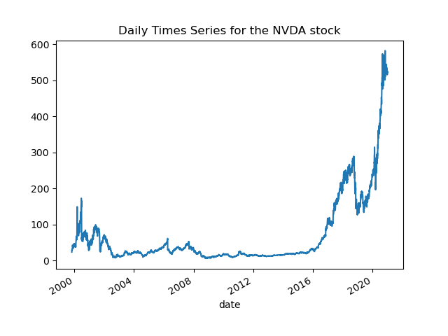

# MPT, The Efficient Frontier, and LSTM's
## An open source project by Jacob Somer
### Goals of this project
1. Get historical stock market data programatically through an API
2. Forecast daily stock prices and covariance using Long Short Term Memory Networks
3. Visualize the efficient frontier and discover new insights in the art of Stock market prediction

*note: if you only want to see step 3, please scroll down to the bottom*

### Helpful resources
For those who are just starting their learning journey in computational finance, here are some learning resources:

* [Youtube Video on Portfolio Management by MIT](https://www.youtube.com/watch?v=8TJQhQ2GZ0Y) 
* [Youtube Series on Machine Learning by 3Blue1Brown](https://www.youtube.com/playlist?list=PLZHQObOWTQDNU6R1_67000Dx_ZCJB-3pi) 
* [Time Series Forecast with Keras](https://keras.io/examples/timeseries/timeseries_weather_forecasting/) 
* [Modern Portfolio Theory Wiki](https://en.wikipedia.org/wiki/Modern_portfolio_theory) 


## The Dataset

This project uses AlphaVantage's [API](https://www.alphavantage.co/documentation/) to get historical data. The benefits of using Alpha Vantage is that their API is free to use. The downside is that they only allow 5 API calls per minute. To account for this, I parralelized the getData() function using the multiparallel library (lines 82-86 in trade):
```
num_cores = multiprocessing.cpu_count()
tmp = tqdm(stockList[i*5:i*5+5])

#parrallizing getting data because its faster
stockData = Parallel(n_jobs=num_cores)(delayed(getData)(j) for j in tmp)
``` 
Get data returns a list of historical data for any stock symbol you give it. In our case, get data returns the open and close price which we will later use as inputs for our returns and covariance prediction. Here is an example dataset plotted with Matplotlib:



A first order observation of this time series (which applies to most assets on the NYSE) is that there is an exponential growth pattern to the price. I accounted this by log transforming the data before feeding it to the LSTM :
```
2**predictNextDay(list(map(lambda x: np.log2(x), np.array(j[0])))
```
(https://pandas.pydata.org/pandas-docs/stable/reference/api/pandas.DataFrame.html) 

